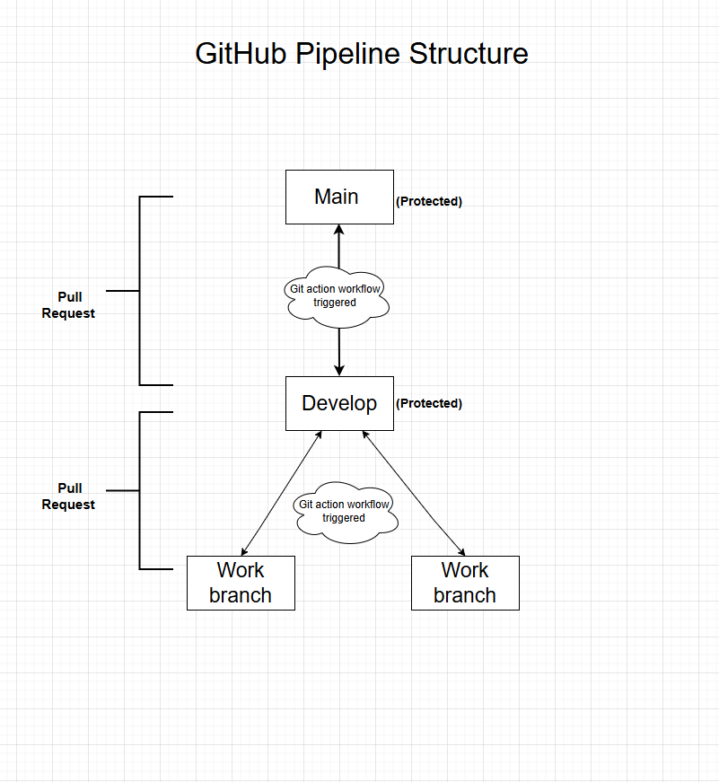

# This repository contains a collection of Ansible playbooks designed to automate system administration tasks, validate playbook syntax, and retrieve network information.

Github Action Workflow:

# This repository contains a collection of Ansible playbooks designed to automate system administration tasks, validate playbook syntax, and retrieve network information  📄 

Github Action Workflow: 🛠️ 

GitHub Actions Workflow
run_ansible.yaml
This GitHub Actions workflow automates the execution of an Ansible playbook whenever changes are pushed to the main branch.

Purpose: CI/CD automation for infrastructure validation or configuration using Ansible.

Runs On: ubuntu-latest

Key Steps:

___________________________________

Installs Ansible. 📦

Checks out the repository code.
Sets up Python.
Prints the current directory and file list for debugging.
Executes the specified Ansible playbook (get_python_version.yaml by default) using the dawidd6/action-ansible-playbook action.
Customizable Inputs:

playbook: Change to any playbook in your repo.
directory: Path to your playbook directory.
inventory: Inventory file used for targeting hosts.

___________________________________

# To run the following playbooks run the command: ansible-playbook <playbook-name>.yaml  🚀 

- ip_address.yaml

Retrieves and displays all IPv4 addresses from the target hosts using Ansible's built-in facts module.

Purpose: Network diagnostics and inventory.
Key Feature: Outputs all IPv4 addresses of the host.

___________________________________

- removedata.yaml

Performs a series of system maintenance tasks:

Checks if the /boot partition is over 80% full.
If so, removes old kernel installations.
Mounts a remote NFS share.
Executes a system check script from the mounted directory.
Purpose: Disk space management and system health checks.
Key Feature: Automates cleanup and remote script execution.

___________________________________

- validator.yaml

Scans and validates all Ansible playbooks in a specified directory for syntax errors.

Purpose: Ensure playbook correctness before deployment.
Key Feature: Recursively finds and checks .yaml files in /etc/ansible/playbooks.

___________________________________

 

- get_os.yaml

Retrieves the operating system distribution and version of the target host.

Purpose: Identify the OS type and version for inventory or compatibility checks.
Key Feature: Uses Ansible facts to print OS name and version (e.g., Ubuntu 22.04).

___________________________________

- get_python_version.yaml

Displays the installed Python version on the target host.

Purpose: Ensure compatibility with Python-based tools or scripts.
Key Feature: Outputs the full Python version (e.g., 3.9.16) using Ansible facts.

___________________________________

- inventory.yaml

Defines a basic Ansible inventory with a single localhost target using local connection.

Purpose: Local testing and development.
Key Feature: Simplifies running playbooks on the local machine without SSH.
# i am making a comment
___________________________________
# Another comment try 
# Visual Diagram 🌐 

